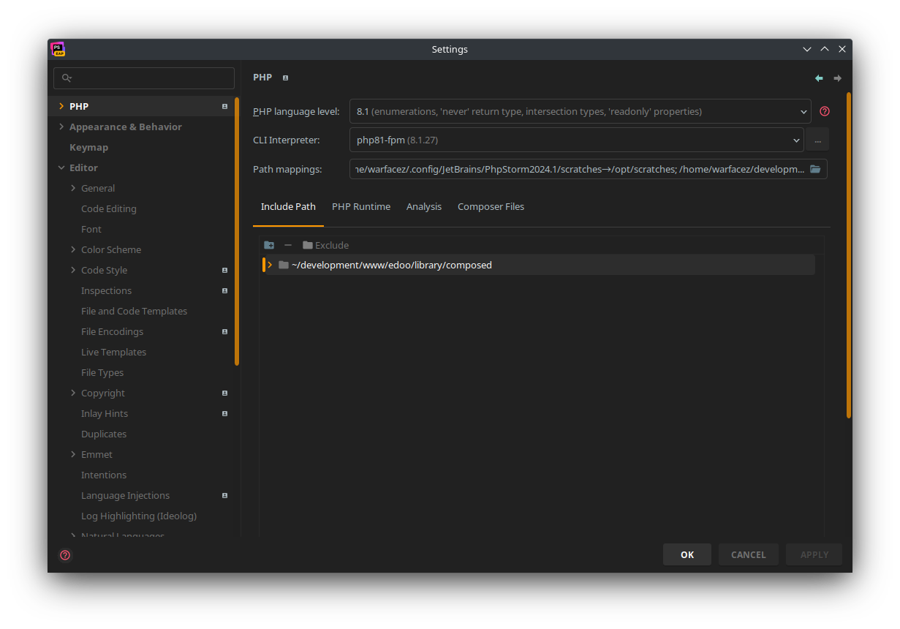
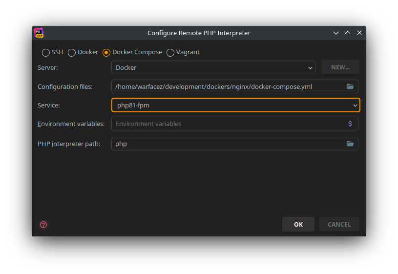
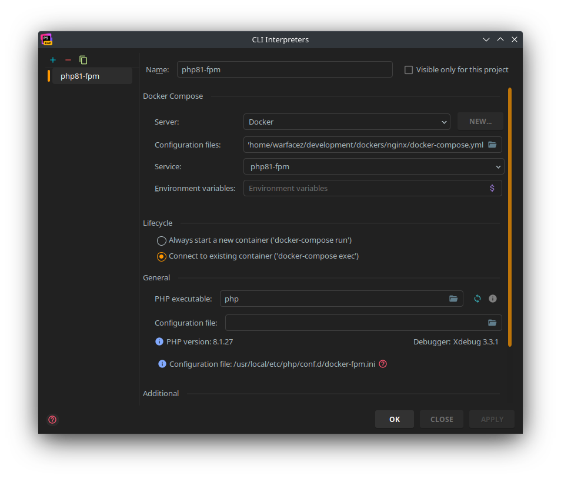
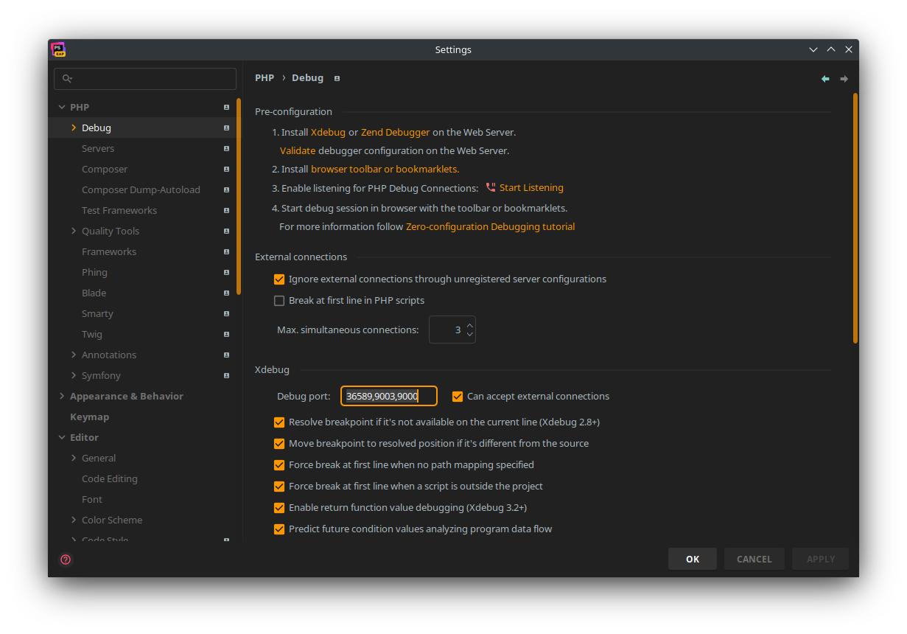

# PHPStorm

## Cli interpreter

Important is select for `Configuration files` docker-compose.yml from this nginx directory. 

## Xdebug

for xdebug we will use `36589`, in PHPStorm we can use `36589,9003,9000` port